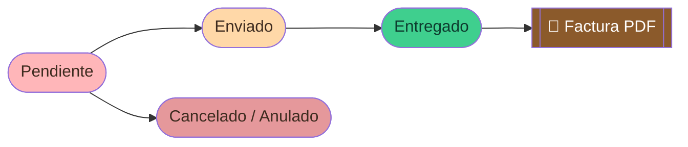
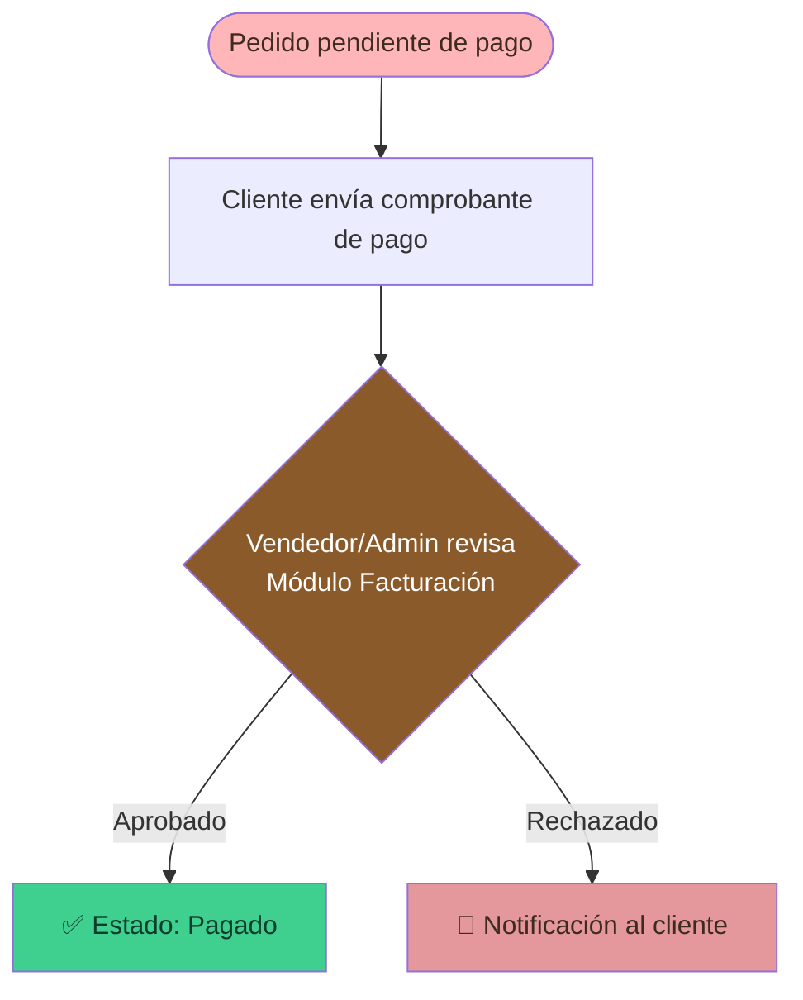
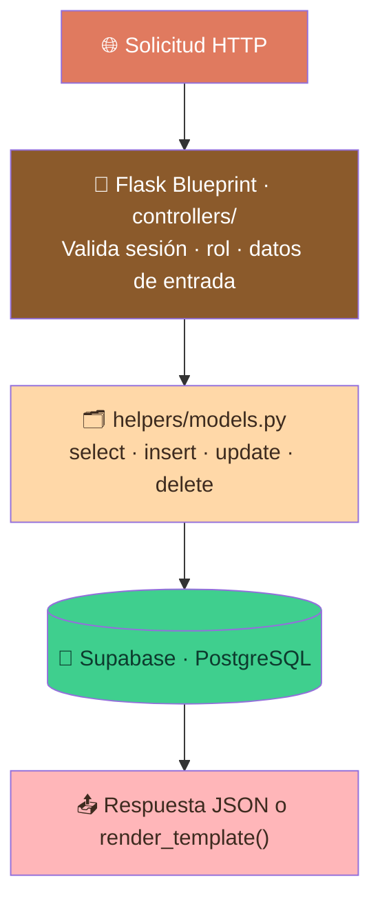

<!-- ============================ HEADER ============================ -->
<div align="center">


<a href="https://readme-typing-svg.demolab.com">
  
</a>

<br/>

**Aplicación web full-stack para la gestión integral de una tienda de postres artesanales.**
Cubre el ciclo completo de venta: catálogo, carrito, pedidos, facturación, mensajería privada y panel administrativo.

<br/>

<!-- ============================ BADGES ============================ -->


</div>

<!-- divider -->


## 📑 Índice

<table>
<tr>
<td>

1. [Descripción General](#-descripción-general)
2. [Stack Tecnológico](#-stack-tecnológico)
3. [Flujo Principal de la Aplicación](#-flujo-principal-de-la-aplicación)
4. [Roles y Permisos](#-roles-y-permisos)
5. [Módulos del Sistema](#-módulos-del-sistema)

</td>
<td>

6. [Arquitectura del Proyecto](#-arquitectura-del-proyecto)
7. [Base de Datos](#-base-de-datos)
8. [Variables de Entorno](#-variables-de-entorno)
9. [Instalación y Ejecución Local](#-instalación-y-ejecución-local)
10. [Despliegue en Producción](#-despliegue-en-producción)

</td>
</tr>
</table>

<br/>

## 🍰 Descripción General

**D'Antojitos©** es una plataforma de comercio electrónico especializada en postres artesanales. Está construida con **Python/Flask** en el backend y **Jinja2 + Bootstrap** en el frontend, conectada a **Supabase (PostgreSQL)** como base de datos principal y a **Cloudinary** para el almacenamiento de imágenes.

La aplicación soporta tres perfiles de usuario con flujos completamente diferenciados: **cliente, vendedor y administrador**. Incluye sistema de internacionalización (ES/EN), modo oscuro, notificaciones en tiempo real, mensajería privada multicanal y generación de facturas en PDF.

<br/>

## 🧱 Stack Tecnológico

<div align="center">


</div>

| Capa | Tecnología |
|------|-----------|
| **Backend** | Python 3.12 · Flask 3.0.3 · Flask-CORS |
| **Servidor (desarrollo)** | Waitress 3.0.0 |
| **Servidor (producción)** | Gunicorn 22.0.0 |
| **Base de datos** | Supabase (PostgreSQL) · supabase-py 2.10.0 |
| **Almacenamiento de imágenes** | Cloudinary 1.41.0 |
| **Autenticación** | Google OAuth2 · sesiones Flask (SHA-256 + salt) |
| **Frontend** | Jinja2 · Bootstrap 5.3.3 · Bootstrap Icons · Vanilla JS |
| **Email transaccional** | Resend 2.30.1 |
| **Despliegue** | Vercel (serverless) |

<br/>

## 🔄 Flujo Principal de la Aplicación

Recorrido completo de un usuario, desde que llega a la tienda hasta la gestión interna del pedido. Cada paso indica **quién** actúa, **dónde** ocurre (ruta) y **qué** sucede en el sistema.

> **1. 🏠 Llegada al Inicio** · `Visitante` · `/inicio`
> El usuario entra a la **Home**: cinta publicitaria dinámica, sección de bienvenida y una vista previa del catálogo. Desde aquí puede navegar libremente sin necesidad de cuenta.

> **2. 🛍️ Exploración del Catálogo** · `Visitante` · `/catalogo`
> Recorre los productos con buscador, filtros y monitor de stock en tiempo real. Puede mirar todo el catálogo aunque aún no haya iniciado sesión.

> **3. 🔐 Autenticación** · `Visitante → Usuario` · `/login` · `/registro`
> Para comprar, se identifica mediante **Google OAuth2** o credenciales propias. Al validarse, se abre una **sesión activa** (24 h) que habilita las acciones de compra.

> **4. 🛒 Carrito de Compras** · `Usuario autenticado` · `/carrito`
> Agrega ítems desde el catálogo, ajusta cantidades y revisa el total calculado. El carrito queda asociado a su cuenta.

> **5. 📦 Generación del Pedido** · `Usuario autenticado` · `Supabase`
> Al confirmar, se crea el pedido en la base de datos con estado inicial **`Pendiente`**. A partir de aquí el flujo se bifurca según el rol.

> **6a. 🙋 Seguimiento del Cliente** · `Cliente`
> Consulta el **estado de su pedido**, su **historial de facturas** y mantiene la **mensajería privada** con el equipo de venta.

> **6b. 🧑‍🍳 Gestión del Staff** · `Vendedor / Admin`
> Administra el pedido desde el **Módulo de Pedidos** (cambio de estado), gestiona **Productos** y atiende la **mensajería de equipo**.

> **7. ⚙️ Administración Avanzada** · `Admin`
> Acceso exclusivo a **Publicidad**, **Facturación**, **Gestión de Usuarios** y la **Zona de Pagos** para cerrar el ciclo de negocio.

**Resumen del recorrido:**

`🏠 Inicio` → `🛍️ Catálogo` → `🔐 Login` → `🛒 Carrito` → `📦 Pedido (Pendiente)` → `🙋 Cliente` · `🧑‍🍳 Staff` → `⚙️ Admin`

### 🧾 Ciclo de vida de un pedido



> El estado del pedido es actualizado por el vendedor o administrador desde el **Módulo de Pedidos**. Al marcar como **Emitida**, el sistema genera automáticamente una factura asociada visible para el cliente en su historial.

### 💳 Ciclo de pago



<br/>

## 👥 Roles y Permisos

| Módulo / Acción | Cliente | Vendedor | Admin |
|---|:---:|:---:|:---:|
| Ver catálogo | ✅ | ✅ | ✅ |
| Agregar al carrito | ✅ | ✅ | ✅ |
| Ver historial de facturas | ✅ (propias) | ✅ (todas) | ✅ |
| Muro de sugerencias | ✅ | ✅ | ✅ |
| Mensajes privados (clientes) | ✅ | ✅ | ❌ |
| Mensajes staff/equipo | ❌ | ✅ | ✅ |
| Gestión de pedidos | ❌ | ✅ | ✅ |
| Gestión de productos | ❌ | ✅ | ✅ |
| Módulo Publicidad | ❌ | ❌ | ✅ |
| Módulo Facturación | ❌ | ❌ | ✅ |
| Gestión de usuarios | ❌ | ❌ | ✅ |
| Ver manual del sistema | ❌ | ✅ | ✅ |

<br/>

## 🧩 Módulos del Sistema

<details open>
<summary><b>👤 Módulos de Usuario (todos los roles)</b></summary>

<br/>

- **🏠 Inicio (`/inicio`)** — Panel principal con cinta publicitaria dinámica, sección de bienvenida configurable y accesos rápidos. Los administradores pueden editar el contenido en modo visual (drag-and-drop).
- **🛍️ Catálogo (`/catalogo_page`)** — Vitrina de productos con filtros, buscador y monitor de stock en tiempo real. Soporte multiidioma (ES/EN).
- **🛒 Carrito (`/carrito_page`)** — Gestión de ítems, cálculo de totales y generación del pedido.
- **⚙️ Perfil (`/mi_perfil`)** — Edición de datos personales con cooldown de 30 días en campos sensibles (cédula, nombre, apellido, usuario), cambio de contraseña y eliminación de cuenta.
- **📄 Historial de Facturas (`/gestionar_facturas_page`)** — Listado de facturas con filtros, vista de detalle, modal de pago con QR y archivado persistente.
- **💬 Sugerencias y Mensajes (`/comentarios_page`)** — Muro público de sugerencias con likes, edición y respuesta por rol. Panel privado con mensajería cliente↔vendedor y staff↔staff.

</details>

<details>
<summary><b>🧑‍🍳 Módulos de Vendedor</b></summary>

<br/>

- **📦 Pedidos (`/pedidos_page`)** — Vista Kanban de todos los pedidos con gestión de estado, diferenciadores visuales por estado (activo/finalizado/anulado) y notificaciones en tiempo real.
- **🧁 Productos (`/gestionar_productos_page`)** — CRUD completo de productos con subida de imágenes a Cloudinary, control de stock y estados.

</details>

<details>
<summary><b>🛡️ Módulos Exclusivos de Administrador</b></summary>

<br/>

- **📢 Publicidad (`/publicidad_page`)** — Gestión de la cinta de inicio (Home Ticker) con control de velocidad y previsualización en vivo.
- **🧾 Facturación (`/facturacion_page`)** — Registro de pagos, validación de comprobantes, generación de facturas y reportes.
- **👥 Gestión de Usuarios (`/gestion_usuarios_page`)** — Alta, edición y gestión de roles de usuarios.
- **📘 Manual del Sistema (`/manual_page`)** — Documentación interna para vendedores y administradores.

</details>

<br/>

## 🏗️ Arquitectura del Proyecto

### Patrón de Capas



<details>
<summary><b>📂 Estructura de carpetas</b></summary>

```
D'Antojitos - Local/
│
├── app.py                          # Punto de entrada · registro de blueprints
├── requirements.txt
├── Dockerfile
│
├── controllers/                    # Blueprints Flask (un archivo por dominio)
│   ├── auth.py                     # Login · Registro · Google OAuth2 · Logout
│   ├── perfil.py                   # Perfil usuario · cooldowns · restricciones
│   ├── perfil_usuarios.py          # Gestión de usuarios (admin)
│   ├── gestion_productos.py        # CRUD productos + Cloudinary
│   ├── catalogo_productos.py       # Catálogo público
│   ├── carrito.py                  # Carrito de compras
│   ├── pedidos_usuarios.py         # Módulo de pedidos (vendedor/admin)
│   ├── historial_facturas.py       # Facturas · archivado · PDF
│   ├── publicidad.py               # Cinta publicitaria (admin)
│   ├── facturacion.py              # Facturación y pagos (admin)
│   ├── comentarios.py              # Muro público · mensajería privada
│   ├── inicio.py                   # Home · configuración de widgets
│   └── paginas_estaticas.py        # Políticas · condiciones · manual
│
├── helpers/
│   ├── models.py                   # Capa de acceso a datos (Supabase)
│   ├── auth.py                     # Decoradores: login_required · vendedor_required · admin_required
│   ├── validators.py               # Validaciones de campos (username, cédula, etc.)
│   ├── cloudinary.py               # Subida y compresión de imágenes
│   └── database.py                 # Cliente Supabase centralizado
│
├── templates/
│   ├── global_modules/             # navbar.html · footer.html · login · registro
│   ├── general_modules/            # inicio · catálogo · carrito · perfil · comentarios · facturas
│   └── admin_modules/              # pedidos · productos · publicidad · facturación · manual
│
└── static/
    ├── css/
    │   ├── global_modules/         # style_navbar · style_footer · style_utils · style_inicio
    │   ├── general_modules/        # style_perfil · style_comentarios · style_catalogo · etc.
    │   └── admin_modules/          # style_pedidos · style_productos · etc.
    ├── js/
    │   ├── global_js/              # utils.js · i18n.js · inicio.js · widget_system.js
    │   ├── general_js/             # perfil.js · comentarios.js · facturas.js · catalogo.js
    │   ├── admin_js/               # pedidos.js · gestion_productos.js · facturacion.js
    │   └── workers/                # Service Workers por módulo
    └── uploads/                    # Archivos estáticos locales (logo, íconos)
```

</details>

<br/>

## 🗄️ Base de Datos

### Tablas principales

| Tabla | Descripción |
|---|---|
| `usuarios` | Datos del usuario, rol, imagen, cooldowns de campos |
| `roles` | Definición de roles: `cliente`, `vendedor`, `admin` |
| `gestion_productos` | Catálogo de productos con stock, precio e imagen |
| `carrito` | Ítems del carrito por usuario |
| `pedidos` | Cabecera del pedido con estado y datos de entrega |
| `pedido_detalle` | Líneas de detalle de cada pedido |
| `facturas` | Facturas generadas, estado de pago y campo `archivada` |
| `metodos_pago` | Métodos de pago habilitados con datos de cuenta y QR |
| `publicidad` | Ítems de la cinta publicitaria con estado activo/inactivo |
| `comentarios` | Muro público de sugerencias con likes |
| `mensajes_privados` | Mensajería privada con columnas `tipo` (cv/staff) y `cedula_dest` |

<details>
<summary><b>🛠️ Migraciones requeridas</b></summary>

```sql
-- Archivado persistente de facturas
ALTER TABLE facturas ADD COLUMN IF NOT EXISTS archivada BOOLEAN DEFAULT FALSE;

-- Canal de mensajería multicanal
ALTER TABLE mensajes_privados ADD COLUMN IF NOT EXISTS tipo TEXT DEFAULT 'cv';
ALTER TABLE mensajes_privados ADD COLUMN IF NOT EXISTS cedula_dest TEXT;

-- Cooldowns de perfil (30 días por campo)
ALTER TABLE usuarios ADD COLUMN IF NOT EXISTS last_change_cedula    TIMESTAMPTZ;
ALTER TABLE usuarios ADD COLUMN IF NOT EXISTS last_change_username   TIMESTAMPTZ;
ALTER TABLE usuarios ADD COLUMN IF NOT EXISTS last_change_nombre     TIMESTAMPTZ;
ALTER TABLE usuarios ADD COLUMN IF NOT EXISTS last_change_apellido   TIMESTAMPTZ;

-- Rol vendedor
INSERT INTO roles (nombre_role) VALUES ('vendedor') ON CONFLICT DO NOTHING;
```

</details>

<br/>

## 🔐 Variables de Entorno

Crear un archivo `.env` en la raíz del proyecto con las siguientes variables:

```env
# Supabase
SUPABASE_URL=https://<proyecto>.supabase.co
SUPABASE_SERVICE_KEY=<service_role_key>
SUPABASE_REST_URL=https://<proyecto>.supabase.co/rest/v1

# Cloudinary
CLOUDINARY_CLOUD_NAME=<cloud_name>
CLOUDINARY_API_KEY=<api_key>
CLOUDINARY_API_SECRET=<api_secret>

# Google OAuth2
GOOGLE_CLIENT_ID=<client_id>.apps.googleusercontent.com

# Flask
FLASK_SECRET_KEY=<clave_aleatoria_segura>
```

<br/>

## 🚀 Instalación y Ejecución Local

### Requisitos previos


### Pasos

```bash
# 1. Clonar el repositorio
git clone <url-del-repositorio>
cd "D'Antojitos - Local"

# 2. Crear y activar entorno virtual
python -m venv venv

# Windows
venv\Scripts\activate

# Linux / macOS
source venv/bin/activate

# 3. Instalar dependencias
pip install -r requirements.txt

# 4. Configurar variables de entorno
cp .env.example .env
# Editar .env con las credenciales correspondientes

# 5. Ejecutar las migraciones SQL en Supabase
# (ver sección Base de Datos → Migraciones requeridas)

# 6. Iniciar el servidor de desarrollo
python app.py
```

El servidor estará disponible en:

| Entorno | URL |
|---|---|
| **Local** | `http://localhost:8000` |
| **Red local** | `http://<IP-local>:8000` |

<br/>

## ☁️ Despliegue en Producción

La aplicación está configurada para desplegarse en **Vercel** en modo serverless con **Gunicorn**.

### Archivos de configuración relevantes

- `Dockerfile` — imagen para contenedores
- `vercel.json` — configuración de rutas y runtime para Vercel

### Variables de entorno en Vercel

Configurar las mismas variables del archivo `.env` directamente en el panel de Vercel bajo **Settings → Environment Variables**.

### Consideraciones de producción

- El modo `debug=True` en `app.py` debe estar desactivado (`debug_mode = False`)
- Las sesiones están configuradas para una duración de **24 horas** (`permanent_session_lifetime`)
- El campo `MAX_CONTENT_LENGTH` admite hasta **50 MB** por subida (imágenes Cloudinary)
- CORS está habilitado globalmente con `flask-cors`

<br/>

## 🌐 Sistema de Internacionalización

La aplicación incluye soporte completo para **Español (ES)** e **Inglés (EN)**.

- Los textos HTML usan el atributo `data-i18n="clave"` para traducción automática
- En JavaScript se usa la función `t('clave')` definida en `static/js/global_js/i18n.js`
- El idioma se guarda en `localStorage` y se aplica en tiempo real sin recarga de página

<br/>

## ✨ Características Adicionales

| | |
|---|---|
| 🌙 **Modo oscuro** | Tema claro/oscuro persistido en `localStorage` |
| 📡 **Monitor de stock** | Polling cada 8 s; notificaciones automáticas al agotarse o reponerse un producto |
| 🔔 **Notificaciones nativas** | Solicitud de permisos del navegador en la primera visita |
| 🎞️ **Cinta publicitaria dinámica** | Ticker configurable con control de velocidad (0.5× · 1× · 1.5× · 2×) |
| ⏳ **Cooldown de 30 días** | Campos sensibles del perfil (cédula, usuario, nombre, apellido) con cuenta regresiva en tiempo real |
| ⚡ **Service Workers** | Caché por módulo y experiencia offline básica |
| 🔝 **Scroll to top** | Barra de progreso de lectura global |

<br/>

<!-- ============================ FOOTER ============================ -->
<div align="center">


**D'Antojitos© — Hecho con amor desde casa.**

</div>
