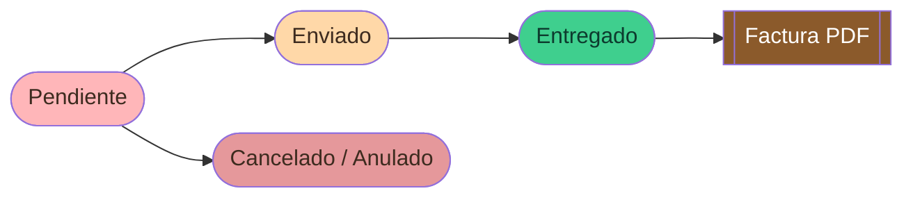
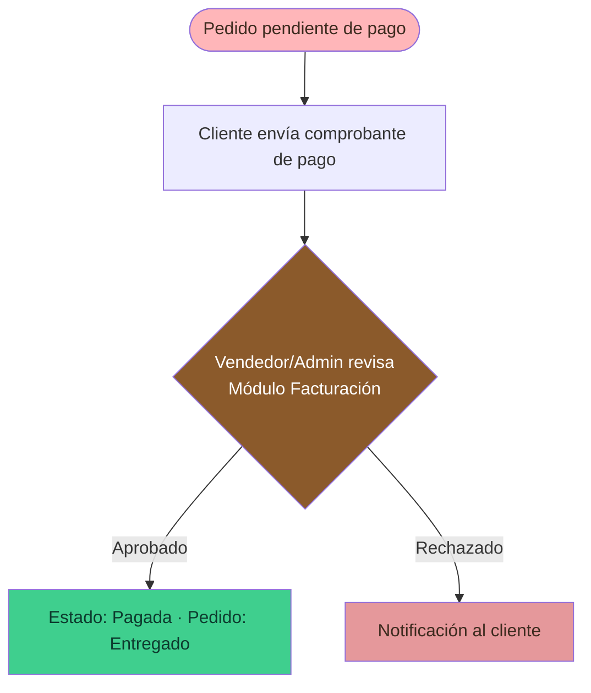
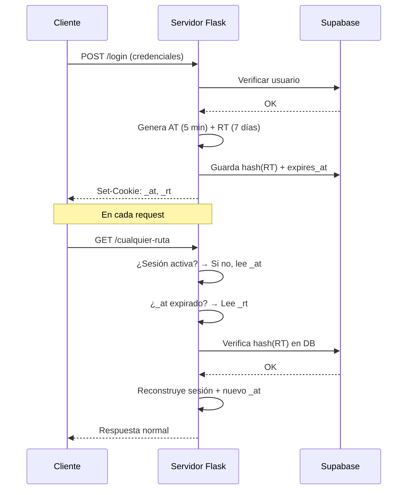
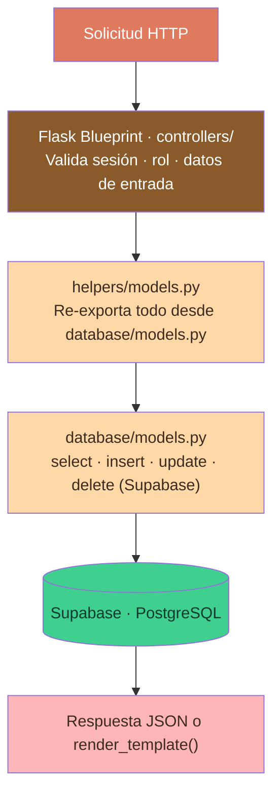

<div align="center">


**Aplicación web full-stack para la gestión integral de una tienda de postres artesanales.**
Cubre el ciclo completo de venta: catálogo, carrito, pedidos, facturación, mensajería privada y panel administrativo.

<br/>


</div>


## Índice

<table>
<tr>
<td>

1. [Descripción General](#descripción-general)
2. [Stack Tecnológico](#stack-tecnológico)
3. [Flujo Principal de la Aplicación](#flujo-principal-de-la-aplicación)
4. [Sistema de Autenticación](#sistema-de-autenticación)
5. [Roles y Permisos](#roles-y-permisos)
6. [Módulos del Sistema](#módulos-del-sistema)

</td>
<td>

7. [Sistema de Notificaciones](#sistema-de-notificaciones)
8. [Sistema de Logros](#sistema-de-logros)
9. [Arquitectura del Proyecto](#arquitectura-del-proyecto)
10. [Base de Datos](#base-de-datos)
11. [Instalación y Ejecución Local](#instalación-y-ejecución-local)
12. [Despliegue en Producción](#despliegue-en-producción)

</td>
</tr>
</table>

<br/>

## Descripción General

**D'Antojitos©** es una plataforma de comercio electrónico especializada en postres artesanales. Está construida con **Python/Flask** en el backend y **Jinja2 + Bootstrap** en el frontend, conectada a **Supabase (PostgreSQL)** como base de datos principal y a **Cloudinary** para el almacenamiento de imágenes.

La aplicación soporta tres perfiles de usuario con flujos completamente diferenciados: **cliente, vendedor y administrador**. Incluye sistema de internacionalización (ES/EN), modo oscuro, notificaciones en tiempo real, mensajería privada multicanal, generación de facturas, descuento de cumpleaños y un sistema de **231 logros** desbloqueables por rol. Se despliega en **Vercel** con soporte adicional para Docker + Gunicorn en entornos contenedorizados.

<br/>

## Stack Tecnológico

<div align="center">


</div>

| Capa | Tecnología |
|------|-----------|
| **Backend** | Python 3.12 · Flask 3.0.3 · Flask-CORS 4.0.1 |
| **Servidor (contenedor)** | Gunicorn 22.0.0 · Docker |
| **Despliegue en la nube** | Vercel |
| **Base de datos** | Supabase (PostgreSQL) · supabase-py 2.10.0 |
| **Almacenamiento de imágenes** | Cloudinary 1.41.0 |
| **Autenticación** | Google OAuth2 · JWT (PyJWT 2.9.0) · SHA-256 + salt |
| **Tokens de sesión** | Access Token (5 min, HttpOnly) · Refresh Token (7 días, HttpOnly) |
| **Frontend** | Jinja2 · Bootstrap 5.3.3 · Bootstrap Icons · TypeScript · Tailwind CSS · Vanilla JS |
| **Build frontend** | esbuild · Tailwind CLI · TypeScript 5.4 |
| **Email transaccional** | Resend 2.30.1 |

<br/>

## Flujo Principal de la Aplicación

Recorrido completo de un usuario desde que llega a la tienda hasta la gestión interna del pedido.

> **1. Llegada al Inicio** · `Visitante` · `/inicio`
> El usuario entra a la Home: cinta publicitaria dinámica con velocidad configurable por admin, carrusel de imágenes, secciones configurables y una vista previa del catálogo. Desde aquí puede navegar libremente sin necesidad de cuenta.

> **2. Exploración del Catálogo** · `Visitante` · `/catalogo_page`
> Recorre los productos con buscador, filtros por categoría y monitor de stock en tiempo real. Puede mirar todo el catálogo sin iniciar sesión.

> **3. Autenticación** · `Visitante → Usuario` · `/login` · `/registro`
> Para comprar, se identifica mediante **Google OAuth2** o credenciales propias (correo/usuario/cédula + contraseña). Al validarse, se generan un **Access Token** (5 min, cookie HttpOnly `_at`) y un **Refresh Token** (7 días, cookie HttpOnly `_rt`) que reconstruyen la sesión automáticamente.

> **4. Carrito de Compras** · `Usuario autenticado` · `/carrito_page`
> Agrega ítems desde el catálogo. El stock se descuenta de forma inmediata (reserva) al agregar y se restaura al quitar. Si es el cumpleaños del cliente se aplica un descuento automático configurable (5 % por defecto). El contador del carrito en la barra de navegación se actualiza en tiempo real en cualquier módulo.

> **5. Generación del Pedido** · `Usuario autenticado` · `Supabase`
> Al confirmar, se crea el pedido en la base de datos con estado inicial **`Pendiente`** y se genera automáticamente la factura con número secuencial (`F-AÑO-000001`). A partir de aquí el flujo se bifurca según el rol.

> **6a. Seguimiento del Cliente** · `Cliente`
> Consulta el estado de su pedido, su historial de facturas y mantiene la mensajería privada con el equipo de venta.

> **6b. Gestión del Staff** · `Vendedor / Admin`
> Administra el pedido desde el **Módulo de Pedidos** (cambio de estado), gestiona Productos y atiende la mensajería de equipo y la mensajería cliente↔vendedor.

> **7. Administración Avanzada** · `Admin`
> Acceso exclusivo a Publicidad, Facturación, Gestión de Usuarios, el Gestor de imágenes Cloudinary y configuración global.

**Resumen del recorrido:**

`Inicio` → `Catálogo` → `Login` → `Carrito` → `Pedido (Pendiente)` → `Cliente` · `Staff` → `Admin`

### Ciclo de vida de un pedido



> El estado del pedido es actualizado por el vendedor o administrador desde el Módulo de Pedidos. Al marcar como **Pagada**, el sistema actualiza la factura y el pedido pasa a **Entregado** automáticamente. Al cancelar, el stock de los productos se restaura.

### Ciclo de pago



<br/>

## Sistema de Autenticación

La autenticación combina **sesiones Flask** con un sistema de **doble token JWT** en cookies HttpOnly.

### Flujo de tokens



| Cookie | Nombre | TTL | Descripción |
|--------|--------|-----|-------------|
| Access Token | `_at` | 5 minutos | JWT firmado con `ACCESS_TOKEN_SECRET`. Se renueva automáticamente. |
| Refresh Token | `_rt` | 7 días | JWT firmado con `REFRESH_TOKEN_SECRET`. Su hash SHA-256 se almacena en `usuarios.web_token`. |

### Seguridad en login

El sistema aplica un **bloqueo progresivo** por intentos fallidos:

| Intentos fallidos | Siguiente bloqueo |
|---|---|
| 5 | bloqueo corto |
| 15 · 25 · 35 · 45 · 55 | bloqueo progresivo |
| 65 | bloqueo largo |
| 75 | bloqueo máximo |

### Registro con Google OAuth2

Los usuarios de Google reciben una cédula temporal con prefijo `G-` (ej. `G-a3f82bc1`). Su correo Google se almacena en el campo `google_account` y el campo `correo` queda vacío hasta que el usuario lo establezca desde el perfil. Un usuario puede tener ambos campos activos simultáneamente (**cuenta dual**). Desde el perfil pueden actualizar su cédula real, lo que desencadena un **cascade update** en todas las tablas relacionadas.

### Método de autenticación (`auth_method`)

El campo `auth_method` se deriva automáticamente del servidor:

| Valor | Condición |
|---|---|
| `email` | Solo tiene `correo` configurado |
| `google` | Solo tiene `google_account` (sin `correo`) |
| `both` | Tiene ambos campos activos |

### Decoradores de acceso

| Decorador | Acceso |
|---|---|
| `@login_required` | Cualquier usuario autenticado |
| `@vendedor_required` | Rol `vendedor` o `admin` |
| `@admin_required` | Solo rol `admin` |
| `@api_token_required` | Valida el token JWT del header `Authorization` o cookie `_at` |

<br/>

## Roles y Permisos

| Módulo / Acción | Cliente | Vendedor | Admin |
|---|:---:|:---:|:---:|
| Ver catálogo | ✅ | ✅ | ✅ |
| Agregar al carrito | ✅ | ✅ | ✅ |
| Finalizar compra | ✅ | ✅ | ✅ |
| Descuento de cumpleaños | ✅ | ✅ | ✅ |
| Ver historial de facturas | ✅ (propias) | ✅ (todas) | ✅ (todas) |
| Anular factura propia | ✅ | ✅ | ✅ |
| Archivar factura | ✅ (solo propias) | ✅ (solo propias) | ✅ (solo propias) |
| Muro de sugerencias | ✅ | ✅ | ✅ |
| Eliminar comentario propio | ✅ | ✅ | ✅ |
| Sistema de logros | ✅ | ✅ | ✅ |
| Editar perfil (cooldown 10 días) | ✅ | ✅ | ✅ |
| Mensajes privados (cliente↔vendedor) | ✅ | ✅ | ❌ |
| Mensajes de equipo (staff↔staff) | ❌ | ✅ | ✅ |
| Gestión de pedidos | ❌ | ✅ | ✅ |
| Gestión de productos | ❌ | ✅ | ✅ |
| Ver historial de todos los usuarios | ❌ | ✅ | ✅ |
| Módulo Publicidad | ❌ | ❌ | ✅ |
| Módulo Facturación (métodos de pago) | ❌ | ❌ | ✅ |
| Gestión de usuarios | ❌ | ❌ | ✅ |
| Gestor de imágenes Cloudinary | ❌ | ❌ | ✅ |
| Configuración global (inicio/descuento) | ❌ | ❌ | ✅ |
| Sembrar logros en BD | ❌ | ❌ | ✅ |
| Ver manual del sistema | ❌ | ✅ | ✅ |

<br/>

## Módulos del Sistema

<details open>
<summary><b>Módulos de Usuario (todos los roles)</b></summary>

<br/>

- **Inicio (`/inicio`)** — Panel principal con cinta publicitaria dinámica (velocidad configurable y persistida en servidor), carrusel de imágenes, secciones de contenido configurables y accesos rápidos.
- **Catálogo (`/catalogo_page`)** — Vitrina de productos con filtros por categoría, buscador en tiempo real y monitor de stock (polling). Soporte multiidioma (ES/EN). No requiere autenticación.
- **Carrito (`/carrito_page`)** — Gestión de ítems con reserva inmediata de stock, cálculo de totales, detección automática de cumpleaños con descuento configurable y generación del pedido + factura al confirmar. El contador del carrito en la barra de navegación se actualiza en tiempo real en cualquier página mediante `/api/carrito/cantidad`.
- **Perfil (`/mi_perfil`)** — Edición de datos personales con **cooldown global de 10 días** en campos de identidad (cédula, nombre, apellido, usuario), cambio de contraseña, subida de foto a Cloudinary y eliminación de cuenta. Los usuarios con cuenta Google pueden vincular un correo D'Antojitos; el campo `google_account` no es editable directamente.
- **Historial de Facturas (`/gestionar_facturas_page`)** — Listado de facturas con filtros, vista de detalle, modal de pago con QR y archivado persistente. Admins y vendedores ven todas las facturas del sistema sin límite. El archivado es exclusivo del propietario.
- **Sugerencias y Mensajes (`/comentarios_page`)** — Muro público de sugerencias con likes, edición y adjuntos. Solo el autor puede eliminar su propio comentario. Panel privado con mensajería cliente↔vendedor (canal CV) y staff↔staff (canal Staff) con UI optimista. Conteo de mensajes sin leer visible en el ícono de la barra de navegación en tiempo real para todos los roles.
- **Logros (`/logros/mis_logros`)** — Sistema de 231 logros desbloqueables agrupados por módulo y rareza, diferenciados por rol.

</details>

<details>
<summary><b>Módulos de Vendedor</b></summary>

<br/>

- **Pedidos (`/pedidos_page`)** — Vista Kanban de todos los pedidos con gestión de estado (`Pendiente → Enviado → Entregado / Cancelado`), marcado de pago, eliminación masiva con restauración automática de stock. Cada card muestra la foto de perfil real del cliente (o su inicial con color único por hash del nombre). Las notificaciones de pedidos en la bandeja se marcan automáticamente como vistas al hacer click en ellas y se navega al módulo correspondiente.
- **Productos (`/gestionar_productos_page`)** — CRUD completo de productos con subida de imágenes a Cloudinary, control de stock y categorías.

</details>

<details>
<summary><b>Módulos Exclusivos de Administrador</b></summary>

<br/>

- **Publicidad (`/publicidad_page`)** — Gestión de contenido visual por tipo: `carrusel`, `seccion`, `cinta`, `inicio_cinta`, `notificacion`, `login_slide`. Control de velocidad de la cinta publicitaria persistido en servidor (`inicio_config.velocidad_cinta`), aplicado en tiempo real en todas las páginas.
- **Facturación (`/facturacion_page`)** — Alta, edición y eliminación de métodos de pago (Nequi, Daviplata, Bancolombia, NuBank) con imagen de QR en Cloudinary.
- **Gestión de Usuarios (`/gestion_usuarios_page`)** — Listado completo de usuarios ordenado por jerarquía de rol: admin → vendedor → cliente. Muestra el método de autenticación con íconos de D'Antojitos y/o Google según si el usuario tiene `correo`, `google_account` o ambos. Filtros que incluyen a usuarios con cuenta dual en ambas categorías.
- **Gestor Cloudinary** — Listado y eliminación de imágenes organizadas por carpeta, disponible desde el módulo de publicidad.
- **Configuración de Inicio** — Control del porcentaje de descuento por cumpleaños y parámetros globales de la página de inicio.
- **Manual del Sistema (`/manual_page`)** — Documentación interna para vendedores y administradores.

</details>

<details>
<summary><b>Páginas Estáticas</b></summary>

<br/>

- **Políticas (`/politicas_page`)** — Política de privacidad y tratamiento de datos (acceso público).
- **Condiciones (`/condiciones_page`)** — Términos y condiciones de uso (acceso público).

</details>

<br/>

## Sistema de Notificaciones

La aplicación cuenta con un sistema de notificaciones en tiempo real distribuido en tres canales independientes.

### Bandeja del sistema (admin / vendedor) — Campana

Muestra notificaciones de pedidos (`Pagado`, `Cancelado`, `Anulada` para admin; `Emitida`, `Cancelado`, `Anulada` para vendedor) obtenidas de `/api/admin/notificaciones_sistema`. Las notificaciones de mensajes privados y cambios de stock se mantienen visibles entre actualizaciones de la bandeja. Al hacer click en una notificación de pedido, se marca automáticamente como vista (equivalente al botón individual) y se navega al módulo de pedidos. Las demás notificaciones permanecen visibles.

### Bandeja del cliente — Campana

Muestra notificaciones de cambios de estado de pedidos propios y mensajes privados sin leer. Persiste en `localStorage`.

### Bandeja de publicidad (admin) — Megáfono

Muestra las notificaciones activas del sistema de publicidad con control de estado activo/inactivo.

### Badge de Sugerencias — Barra de navegación

El ícono de Sugerencias muestra en tiempo real el conteo de mensajes privados sin leer, visible en cualquier módulo. Se actualiza mediante polling cada 6 segundos para todos los roles.

### Badge del Carrito — Barra de navegación

El ícono del carrito muestra el conteo de ítems actualizado en tiempo real mediante el endpoint `/api/carrito/cantidad` (polling cada 10 segundos) y eventos `storage` del navegador. Visible en cualquier módulo sin necesidad de navegar al carrito.

<br/>

## Sistema de Logros

El sistema incluye **231 logros** distribuidos en **11 módulos**, con **4 niveles de rareza** y diferenciados por rol de usuario.

### Rarezas

| Rareza | Puntos | Descripción |
|---|---|---|
| Común | 5–20 | Acciones básicas del día a día |
| Raro | 20–50 | Constancia o cantidad moderada |
| Épico | 50–80 | Hitos de uso avanzado |
| Legendario | 100–200 | Récords de la plataforma |

### Módulos de logros

| Módulo | Logros |
|---|:---:|
| Inicio (`ini_*`) | 21 |
| Catálogo (`cat_*`) | 21 |
| Carrito (`cart_*`) | 21 |
| Pagos (`pago_*`) | 21 |
| Sugerencias (`sug_*`) | 21 |
| Mensajes (`msg_*`) | 21 |
| Perfil (`prf_*`) | 21 |
| Historial (`fac_*`) | 21 |
| Productos (`prod_*`) | 21 |
| Publicidad (`pub_*`) | 21 |
| Usuarios (`usr_*`) | 21 |

### Endpoints de logros

| Método | Ruta | Acceso | Descripción |
|---|---|---|---|
| `GET` | `/logros/todos` | Público | Lista todos los logros definidos |
| `GET` | `/logros/mis_logros` | Autenticado | Logros del usuario y estadísticas |
| `POST` | `/logros/verificar` | Autenticado | Verifica y otorga logros según contexto |
| `POST` | `/logros/sembrar` | Admin | Inserta o actualiza definiciones de logros en BD |

<br/>

## Arquitectura del Proyecto

### Patrón de Capas



<details>
<summary><b>Estructura de carpetas</b></summary>

```
WEB_D.Antojitos_2026/
│
├── app.py                          # Punto de entrada · registro de blueprints · middleware JWT
├── requirements.txt                # Dependencias Python
├── Dockerfile                      # Imagen Docker con Gunicorn (puerto 7860)
├── vercel.json                     # Configuración de despliegue en Vercel
├── package.json                    # Build frontend: esbuild + Tailwind CLI
├── tsconfig.json                   # Configuración TypeScript
│
├── controllers/                    # Blueprints Flask (un archivo por dominio)
│   ├── auth.py                     # Login · Registro · Google OAuth2 · Logout · Refresh token
│   ├── perfil.py                   # Perfil usuario · cooldowns · restricciones · cambio contraseña
│   ├── perfil_usuarios.py          # Gestión de usuarios (admin)
│   ├── gestion_productos.py        # CRUD productos + Cloudinary
│   ├── catalogo_productos.py       # Catálogo público (sin autenticación requerida)
│   ├── carrito.py                  # Carrito · reserva de stock · finalizar compra · /api/carrito/cantidad
│   ├── pedidos_usuarios.py         # Módulo de pedidos (vendedor/admin) · Kanban · restauración de stock
│   ├── historial_facturas.py       # Facturas · archivado · anulación · búsqueda multicriterio
│   ├── publicidad.py               # Publicidad multimedia · notificaciones sistema · gestor Cloudinary
│   ├── facturacion.py              # Métodos de pago + QR (admin)
│   ├── comentarios.py              # Muro público · mensajería privada CV y Staff
│   ├── inicio.py                   # Config de inicio · descuento cumpleaños · velocidad cinta
│   ├── logros.py                   # Sistema de logros · mis logros · verificar · sembrar
│   └── paginas_estaticas.py        # Políticas · condiciones · manual del sistema
│
├── helpers/
│   ├── models.py                   # Re-exporta toda la capa de datos
│   ├── auth.py                     # Decoradores · JWT (AT/RT) · hash contraseña · sesión
│   ├── validators.py               # Validaciones de campos · constantes de dominio
│   ├── cloudinary.py               # Subida, compresión, listado y eliminación de imágenes
│   └── logros_utils.py             # Definición de los 231 logros · función verificar_y_otorgar()
│
├── database/
│   ├── database.py                 # Cliente Supabase centralizado
│   └── models.py                   # Todas las funciones de acceso a datos
│
├── templates/
│   ├── global_modules/             # navbar.html · footer.html · login · registro · blocked
│   ├── general_modules/            # inicio · catálogo · carrito · perfil · comentarios · facturas
│   └── admin_modules/              # pedidos · productos · publicidad · facturación · gestión usuarios
│
└── static/
    ├── css/
    │   ├── global_modules/         # Estilos navbar · footer · utils · inicio · login
    │   ├── general_modules/        # Estilos perfil · comentarios · catálogo · facturas
    │   └── admin_modules/          # Estilos pedidos · productos · publicidad · gestión usuarios
    ├── ts/                         # Fuentes TypeScript (compilados con esbuild)
    ├── js/
    │   ├── compiled/               # JS compilados desde TypeScript
    │   ├── global_js/              # utils.js · i18n.js · inicio.js · login_registro.js
    │   ├── general_js/             # perfil.js · comentarios.js · facturas.js · carrito.js
    │   ├── admin_js/               # pedidos.js · gestion_productos.js · publicidad.js
    │   └── workers/                # Service Workers por módulo (caché offline · estrategia por tipo de recurso)
    └── uploads/                    # Archivos estáticos locales (logo, íconos, imagen de perfil por defecto)
```

</details>

<br/>

## Base de Datos

### Tablas principales

| Tabla | Descripción |
|---|---|
| `usuarios` | Datos del usuario, rol, imagen, cooldowns, tokens JWT, intentos de login, bloqueo, `google_account` |
| `roles` | Definición de roles: `cliente`, `vendedor`, `admin` |
| `gestion_productos` | Catálogo de productos con stock, precio, categoría e imagen |
| `carrito` | Ítems del carrito por usuario (con reserva de stock activa) |
| `pedidos` | Cabecera del pedido con estado, pagado, número de factura y datos de entrega |
| `pedido_detalle` | Líneas de detalle de cada pedido (producto, cantidad, precio unitario) |
| `facturas` | Facturas con número secuencial, estado de pago y campo `archivada` |
| `metodos_pago` | Métodos de pago con entidad, tipo de cuenta, número, titular, QR y `clave_pago` |
| `publicidad` | Ítems de contenido multimedia por tipo con estado activo/inactivo |
| `comentarios` | Muro público de sugerencias con likes por usuario y adjuntos en base64 |
| `mensajes_privados` | Mensajería privada con columna `tipo` (cv/staff), `cedula_dest` y adjuntos |
| `inicio_config` | Configuración global del sistema (descuento cumpleaños, `velocidad_cinta`, etc.) |
| `logros` | Definición maestra de los 231 logros (código, nombre, rareza, puntos, roles) |
| `usuario_logros` | Relación usuario ↔ logro desbloqueado con timestamp de obtención |

### Tipos y constantes de dominio

| Constante | Valores |
|---|---|
| `ESTADOS_PEDIDO` | `Pendiente`, `Enviado`, `Entregado`, `Cancelado` |
| `ESTADOS_FACTURA` | `Emitida`, `Anulada`, `Pagada` |
| `METODOS_PAGO_VALIDOS` | `Efectivo`, `Transferencia` |
| `ENTIDADES_PAGO` | `Nequi`, `Daviplata`, `Bancolombia`, `NuBank` |
| `TIPOS_PUBLICIDAD` | `carrusel`, `seccion`, `cinta`, `inicio_cinta`, `notificacion`, `login_slide` |

<details>
<summary><b>Migraciones requeridas</b></summary>

```sql
-- Archivado persistente de facturas
ALTER TABLE facturas ADD COLUMN IF NOT EXISTS archivada BOOLEAN DEFAULT FALSE;

-- Canal de mensajería multicanal
ALTER TABLE mensajes_privados ADD COLUMN IF NOT EXISTS tipo TEXT DEFAULT 'cv';
ALTER TABLE mensajes_privados ADD COLUMN IF NOT EXISTS cedula_dest TEXT;

-- Cooldowns de perfil (10 días por campo)
ALTER TABLE usuarios ADD COLUMN IF NOT EXISTS last_change_cedula      TIMESTAMPTZ;
ALTER TABLE usuarios ADD COLUMN IF NOT EXISTS last_change_username     TIMESTAMPTZ;
ALTER TABLE usuarios ADD COLUMN IF NOT EXISTS last_change_nombre       TIMESTAMPTZ;
ALTER TABLE usuarios ADD COLUMN IF NOT EXISTS last_change_apellido     TIMESTAMPTZ;
ALTER TABLE usuarios ADD COLUMN IF NOT EXISTS last_change_contrasena   TIMESTAMPTZ;

-- Sistema de tokens JWT
ALTER TABLE usuarios ADD COLUMN IF NOT EXISTS web_token   TEXT;
ALTER TABLE usuarios ADD COLUMN IF NOT EXISTS expires_at  TIMESTAMPTZ;

-- Seguridad en login
ALTER TABLE usuarios ADD COLUMN IF NOT EXISTS intentos_fallidos INTEGER DEFAULT 0;
ALTER TABLE usuarios ADD COLUMN IF NOT EXISTS bloqueado_hasta    TIMESTAMPTZ;

-- Fecha de cumpleaños para descuento
ALTER TABLE usuarios ADD COLUMN IF NOT EXISTS fecha_nacimiento DATE;

-- Cuenta Google (separada del correo D'Antojitos)
ALTER TABLE usuarios ADD COLUMN IF NOT EXISTS google_account TEXT;

-- Número de factura en pedido
ALTER TABLE pedidos ADD COLUMN IF NOT EXISTS numero_factura TEXT;

-- Clave de pago en métodos de pago
ALTER TABLE metodos_pago ADD COLUMN IF NOT EXISTS clave_pago TEXT NOT NULL DEFAULT '';

-- Configuración global
CREATE TABLE IF NOT EXISTS inicio_config (
    id      SERIAL PRIMARY KEY,
    clave   TEXT UNIQUE NOT NULL,
    valor   TEXT
);

INSERT INTO inicio_config (clave, valor) VALUES ('velocidad_cinta', '1') ON CONFLICT (clave) DO NOTHING;

-- Sistema de logros
CREATE TABLE IF NOT EXISTS logros (
    id      SERIAL PRIMARY KEY,
    codigo  TEXT UNIQUE NOT NULL,
    nombre  TEXT,
    rareza  TEXT,
    puntos  INTEGER DEFAULT 0,
    modulo  TEXT,
    roles   TEXT[]
);

CREATE TABLE IF NOT EXISTS usuario_logros (
    id           SERIAL PRIMARY KEY,
    cedula       TEXT REFERENCES usuarios(cedula) ON DELETE CASCADE,
    codigo_logro TEXT REFERENCES logros(codigo),
    obtenido_at  TIMESTAMPTZ DEFAULT NOW(),
    UNIQUE (cedula, codigo_logro)
);

-- Rol vendedor
INSERT INTO roles (nombre_role) VALUES ('vendedor') ON CONFLICT DO NOTHING;
```

</details>

<br/>

## Instalación y Ejecución Local

### Requisitos previos

- Python 3.12+
- Node.js 18+
- Cuenta activa en Supabase, Cloudinary y Google Cloud Console

### Pasos

```bash
# 1. Clonar el repositorio
git clone <url-del-repositorio>
cd "WEB_D.Antojitos_2026"

# 2. Crear y activar entorno virtual Python
python -m venv venv
venv\Scripts\activate          # Windows
source venv/bin/activate       # Linux / macOS

# 3. Instalar dependencias Python
pip install -r requirements.txt

# 4. Instalar dependencias frontend
npm install

# 5. Compilar assets frontend (TypeScript + Tailwind)
npm run build

# 6. Ejecutar las migraciones SQL en Supabase

# 7. Iniciar el servidor de desarrollo
python app.py
```

El servidor estará disponible en `http://localhost:8000`.

### Watch mode (desarrollo frontend)

```bash
npm run watch
```

### Modo debug

Para activar el modo debug con recarga automática, editar `app.py`:

```python
debug_mode = True
```

<br/>

## Despliegue en Producción

### Vercel

La aplicación se despliega en Vercel utilizando el adaptador WSGI para Python/Flask. El archivo `vercel.json` define el ruteo:

```json
{
  "version": 2,
  "builds": [{ "src": "app.py", "use": "@vercel/python" }],
  "routes": [{ "src": "/(.*)", "dest": "app.py" }]
}
```

Cada push a `master` dispara un deploy automático si el repositorio está conectado al dashboard de Vercel.

### Consideraciones de producción

- Las imágenes se almacenan en Cloudinary (el filesystem de Vercel es efímero).
- Las cookies `_at` y `_rt` se emiten con `Secure=True` y `SameSite=Strict` automáticamente en producción.
- El campo `MAX_CONTENT_LENGTH` admite hasta 50 MB por subida.
- El dominio de producción debe estar registrado como **Authorized JavaScript origin** y **Authorized redirect URI** en Google Cloud Console para que OAuth2 funcione.

### Docker (alternativo)

```bash
docker build -t dantojitos .
docker run -p 7860:7860 dantojitos
```

La imagen Docker usa **Gunicorn con 2 workers** en el puerto **7860**.

<br/>

## Características Destacadas

| Característica | Descripción |
|---|---|
| Modo oscuro | Tema claro/oscuro persistido en `localStorage` |
| Monitor de stock | Polling cada 30 s; notificaciones automáticas al agotarse o reponerse un producto |
| Internacionalización | Español e Inglés, cambiable en tiempo real sin recarga |
| Cinta publicitaria | Ticker configurable con velocidad (0.5× · 1× · 1.5× · 2×) persistida en servidor |
| Descuento de cumpleaños | Porcentaje configurable por admin; detección automática; uso único por día |
| Bloqueo progresivo de login | Bloqueo escalado desde 5 hasta 75 intentos fallidos |
| Doble token JWT | Access Token (5 min) + Refresh Token (7 días); renovación transparente |
| Reserva de stock | Stock se descuenta al agregar al carrito y se restaura al quitar o cancelar |
| Sistema de logros | 231 logros · 11 módulos · 4 rarezas · 3 roles · notificación en tiempo real |
| Cooldown de 10 días | Campos de identidad del perfil con cuenta regresiva visible |
| Cascade de cédula | Usuarios Google pueden establecer cédula real con update en cascade de todas las FK |
| Service Workers | Caché por módulo con estrategia diferenciada (cacheFirst · networkFirst · staleWhileRevalidate) |
| Notificaciones en tiempo real | Tres canales independientes: sistema (admin/vendedor), cliente y publicidad |
| Badge de carrito universal | Contador de ítems visible en cualquier módulo, actualizado en tiempo real |
| Badge de mensajes privados | Contador de mensajes sin leer visible en el ícono de Sugerencias en toda la app |
| Notificaciones accionables | Click en notificación = marca como vista + navega al módulo correspondiente |
| Mensajes con UI optimista | Los mensajes privados aparecen al instante; botón de envío bloqueado durante el fetch |
| Avatares con color único | Paleta de 24 colores asignada por hash del nombre; consistente en todos los módulos |
| Autenticación dual | Un usuario puede tener simultáneamente cuenta D'Antojitos y cuenta Google |
| Eliminación de comentarios | Solo el autor puede eliminar su propio comentario |
| Facturas sin límite histórico | Admin y vendedor ven absolutamente todas las facturas del sistema |
| Archivado exclusivo del propietario | Solo el dueño de una factura puede archivarla |
| Gestor Cloudinary integrado | Admin puede listar y eliminar imágenes de Cloudinary desde la propia aplicación |
| TypeScript + Tailwind | Assets compilados con esbuild y Tailwind CLI; watch mode para desarrollo |

<br/>

<div align="center">


**2025 D'Antojitos© - TERESA RUBIO GARCÍA**<br>
**Created By: 2022 YisusPrime™**

</div>
